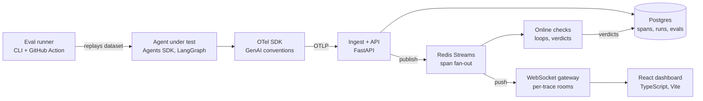

# Agent Observability Dashboard PRD

Last updated 27 September 2026 · Author Rithani Saravanakumar

## Overview

Build a self-hostable, real-time dashboard that traces every step of an AI agent run and tells you when a prompt or model change made the agent worse. The working name is **Tracewell**. It streams tool calls, latency, tokens, cost and failures over WebSockets as they happen, then replays the same test suite against each prompt and model version to flag regressions before they ship.

The pitch in one line. A live flight recorder and regression alarm for multi-agent systems, built on OpenTelemetry so it plugs into any framework.

The motivation comes from shipping production agents in healthcare, including a validation agent that checks reports before they reach patients and a multi-agent vision pipeline evaluated against Nutrition5k. Both needed a way to see what each agent did step by step and to prove that a prompt change was safe. Tracewell is that tool.

## Problem, users and use cases

Agents fail quietly. A multi-step run can call the wrong tool, loop, blow its token budget or return confident nonsense, and the only artifact is a final answer. Teams tweak a system prompt or swap a model, eyeball five examples and ship. Two weeks later a customer finds the regression.

**Primary user.** An AI engineer at a small startup who owns a few production agents, has no dedicated ML platform team and needs answers in minutes.

**Secondary user.** A product manager or domain reviewer who wants to see why the agent did something without reading logs.

### Core jobs to be done

1. Watch a run live and see which step is slow, expensive or broken.
2. Open a failed run and understand the root cause in under 60 seconds.
3. Change a prompt or model and know, before merging, whether quality went up or down.
4. Show a non-engineer a readable timeline of what the agent did and why.
5. Track cost and failure trends across a week of traffic.

### Hero scenario for the demo

You change the system prompt of a research agent to be more concise. The eval suite runs in CI. Pass rate drops from 92% to 78% because the agent now skips its search tool on multi-hop questions. The PR check fails, the dashboard's compare view highlights the 7 flipped cases, and one click opens the trace showing the missing tool call.

## Market landscape

The space is crowded and consolidating. Tracewell does not try to replace these tools. It focuses on a few gaps and interoperates with the rest through OTLP.

| Tool | Open source | What it is known for | What to borrow |
| --- | --- | --- | --- |
| [Langfuse](https://github.com/langfuse/langfuse) | Yes, MIT | Most adopted open source tracer, prompt management, datasets, GitHub Action regression tests. Acquired by ClickHouse in 2026 | Nested trace tree, dataset runs, self-host story |
| [LangSmith](https://www.marktechpost.com/2026/08/09/top-llm-observability-and-evaluation-platforms-in-2026-langfuse-langsmith-braintrust-arize-and-more-compared/) | No | Deep LangChain and LangGraph integration, side-by-side comparisons, AI root-cause assistant | Compare view, root-cause summary |
| [Braintrust](https://www.marktechpost.com/2026/08/09/top-llm-observability-and-evaluation-platforms-in-2026-langfuse-langsmith-braintrust-arize-and-more-compared/) | No | Strongest eval workflow with versioned datasets, scorers and CI regression checks | Experiment diff table, scorer design |
| [Arize Phoenix](https://www.morphllm.com/ai-agent-observability-tools) | Source available, ELv2 | OpenTelemetry native via OpenInference, single-container deploy, trajectory evals | OpenInference span kinds, one-command setup |
| [AgentOps](https://www.morphllm.com/ai-agent-observability-tools) | Yes, MIT | Agent-first design with time travel debugging | Session replay |
| [OpenLLMetry by Traceloop](https://www.morphllm.com/ai-agent-observability-tools) | Yes, Apache 2.0 | Pure OpenTelemetry auto-instrumentation for LLM providers | Use it as an ingestion source |
| [MLflow](https://mlflow.org/top-5-agent-observability-tools/) | Yes, Apache 2.0 | Agent tracing plus judges, exports in OTel GenAI format | Judge alignment ideas |
| [Helicone](https://www.morphllm.com/ai-agent-observability-tools) | Yes, Apache 2.0 | Proxy-based cost and latency dashboards, reported in maintenance mode since March 2026 | Cost dashboard layout |
| [Datadog LLM Observability](https://www.marktechpost.com/2026/08/09/top-llm-observability-and-evaluation-platforms-in-2026-langfuse-langsmith-braintrust-arize-and-more-compared/) | No | LLM traces tied to infra metrics and security signals | Prompt-injection flags |

Eval-only tools worth wiring in are [promptfoo](https://www.promptfoo.dev/docs/integrations/ci-cd/) (YAML test suites with a GitHub Action), [DeepEval](https://deepeval.com/guides/guides-ai-agent-evaluation-metrics) (agent metrics like tool correctness and step efficiency) and [τ²-bench](https://github.com/sierra-research/tau2-bench) (MIT-licensed tool-agent-user benchmark for airline, retail, telecom and banking tasks).

### Positioning

1. **Live, not after the fact.** Most tools show a trace once it is ingested. A true streaming view where you watch an agent think is rare.
2. **A verdict per turn.** A [2026 review of twelve tools](https://www.morphllm.com/ai-agent-observability-tools) notes none give a real-time judgment of whether each agent turn was acceptable (loops, policy violations, user frustration). An online checker that flags loops and wasted tool calls live is the signature feature.
3. **Standards first, tiny footprint.** Accept plain OTLP with the OpenTelemetry GenAI conventions, run with one `docker compose up`, and work next to Langfuse or Phoenix.

Positioning line. *A lightweight, OpenTelemetry-native flight recorder for AI agents, with live streaming traces, online loop and failure detection, and CI regression gates.*

## Goals, non-goals and success metrics

### Goals

1. Ingest agent traces from any framework through OTLP and show them live in the browser.
2. Make every failure explainable in one click, with the offending span highlighted.
3. Run a versioned eval suite and block regressions in CI.
4. Be runnable by a stranger in under 5 minutes.

### Non-goals for v1

- Multi-tenant auth, billing or SSO.
- Prompt management or a playground.
- Petabyte scale. Design for about 1 million spans on a laptop.
- Training or fine-tuning models.

### Success metrics

Measure these with a load script and publish the script so anyone can reproduce them.

| Metric | Target | How to measure |
| --- | --- | --- |
| Ingest to screen latency, p95 | Under 500 ms | Timestamp at SDK export vs browser render, 1,000 spans |
| Sustained ingest throughput | 2,000+ spans per second on a laptop | `k6` or a Python load generator hitting the OTLP endpoint |
| Dashboard load for a 500-span trace | Under 1 second | Lighthouse or Playwright timing |
| Eval suite size | 100+ cases across 3 agent tasks | Count in `evals/datasets` |
| Regressions caught | At least 2 real, documented prompt or model regressions blocked by CI | Linked PRs in the README |
| Judge agreement with human labels | Cohen's kappa 0.6 or higher on 50 hand-labeled cases | Script in `evals/calibration` |
| Time to first trace for a new user | Under 5 minutes | Timed trials with 3 new users |
| Test coverage on the ingest and eval packages | 80%+ | CI coverage badge |

## Functional requirements

P0 ships in the MVP. P1 makes it stand out. P2 is stretch.

| ID | Area | Requirement | Priority |
| --- | --- | --- | --- |
| ING-1 | Ingestion | Accept OTLP over HTTP (protobuf and JSON) at `/v1/traces` | P0 |
| ING-2 | Ingestion | Parse OTel GenAI attributes (`gen_ai.operation.name`, `gen_ai.request.model`, `gen_ai.usage.input_tokens`, `gen_ai.tool.name`, `error.type`) and OpenInference span kinds | P0 |
| ING-3 | Ingestion | Thin Python SDK with `@trace_agent` and `@trace_tool` decorators for code that has no instrumentation | P0 |
| ING-4 | Ingestion | Redact PII and secrets by regex before storage, content capture off by default | P1 |
| LIVE-1 | Live view | Push new and updated spans to subscribed browsers over WebSockets within 500 ms | P0 |
| LIVE-2 | Live view | Runs list that updates live with status, duration, tokens and cost | P0 |
| LIVE-3 | Live view | Backpressure and reconnect, so a burst of 10,000 spans never freezes the tab | P1 |
| TRACE-1 | Trace detail | Waterfall timeline of nested spans with duration bars | P0 |
| TRACE-2 | Trace detail | Span panel with inputs, outputs, tool arguments, errors and raw attributes | P0 |
| TRACE-3 | Trace detail | Agent graph view showing hand-offs between agents and tools | P1 |
| TRACE-4 | Trace detail | Plain-English run summary generated by an LLM for non-engineers | P2 |
| MET-1 | Metrics | p50 and p95 latency, tokens and cost per model, tool and agent over time | P0 |
| MET-2 | Metrics | Failure rate by type (tool error, timeout, invalid JSON, guardrail block, max steps hit) | P0 |
| DET-1 | Online checks | Flag loops (same tool, same args, 3+ times), runaway token use and dead-end tool calls live | P1 |
| DET-2 | Online checks | Per-turn verdict chip (ok, warn, fail) from cheap heuristics plus an optional judge | P1 |
| EVAL-1 | Evals | Versioned datasets of test cases in YAML or JSONL | P0 |
| EVAL-2 | Evals | Runner that replays a dataset against an agent version and records every trace | P0 |
| EVAL-3 | Evals | Scorers for exact match, JSON schema, tool-call correctness, and LLM-as-judge with a rubric | P0 |
| EVAL-4 | Evals | Tag every run with prompt hash, model, git SHA and dataset version | P0 |
| EVAL-5 | Evals | Compare view that diffs two runs case by case and links each flipped case to its trace | P0 |
| EVAL-6 | Evals | Statistical check so a 2-point drop on 20 cases is not called a regression (bootstrap CI or McNemar) | P1 |
| CI-1 | CI | GitHub Action that runs the suite on PRs touching prompts and fails below a threshold | P0 |
| CI-2 | CI | PR comment with pass rate, cost delta, latency delta and links to flipped traces | P1 |
| ALERT-1 | Alerts | Slack or Discord webhook when failure rate crosses a threshold over 15 minutes | P2 |
| OPS-1 | Ops | One-command local setup via Docker Compose and a seeded demo | P0 |
| OPS-2 | Ops | Public read-only demo instance with synthetic traffic | P1 |
| MCP-1 | Integrations | Trace MCP tool calls as `execute_tool` spans with server name | P2 |

## Architecture and data flow

Three paths share one store. The write path turns OTLP spans into rows. The live path fans each span out to browsers watching that run. The eval path replays a dataset through the agent so eval runs produce ordinary traces, which means every failed test case is one click from its full trace.



The dashboard reads history through the same FastAPI service over REST, and only uses the WebSocket for what changed since the page loaded.

### Design decisions

1. **Live spans need a start event.** The standard OpenTelemetry batch processor only exports a span after it ends, so a 40-second agent run would appear all at once at the end. The Tracewell SDK adds a small custom span processor whose `on_start` hook sends a lightweight "span opened" event, so the UI can draw a pending bar that fills in when the span closes. Third-party OTLP sources still work, they just appear as spans complete.
2. **Coalesce before you push.** The gateway batches updates per room every 100 ms, so a burst of 5,000 spans becomes 10 messages a second. The client virtualizes long lists with TanStack Virtual.
3. **Rooms, not broadcast.** Clients subscribe to `runs` for the list view and `trace:<id>` for a detail page. Redis Streams lets two gateway replicas run without losing messages.
4. **Store raw, index what you query.** Keep the full span as JSONB, and promote the handful of fields used in filters (trace id, parent id, operation, model, tool, status, start time, tokens) to real columns.
5. **Evals are just traces with tags.** The runner sets resource attributes like `tracewell.eval.run_id` and `tracewell.prompt.hash`, so there is one data model, one UI and one set of queries for production traffic and test runs alike.
6. **Content capture is opt-in.** Matching the OTel GenAI default, prompts and tool arguments are only stored when a flag is on, with a redaction hook.

## Recommended tech stack

| Layer | Choice | Why this one | Swap-in |
| --- | --- | --- | --- |
| Instrumentation | OpenTelemetry Python SDK plus [OpenLLMetry](https://www.morphllm.com/ai-agent-observability-tools) or [OpenInference](https://github.com/Arize-ai/openinference) auto-instrumentors | Standard, framework agnostic, zero lock-in | Tracewell SDK only |
| SDK | Small Python package `tracewell` with decorators and the `on_start` live processor | Clean API surface, publishable to PyPI | TypeScript SDK as a P2 |
| Ingest and API | FastAPI, Pydantic v2, `opentelemetry-proto` for decoding | Async, typed, fast to build | Go with `net/http` |
| Live fan-out | Redis Streams | Durable, lets gateways scale horizontally | Postgres `LISTEN/NOTIFY` for a smaller MVP |
| Storage | Postgres 16 with JSONB, optional TimescaleDB for metrics rollups | Familiar, flexible, enough for 1M spans | ClickHouse as a P2 benchmark |
| Frontend | React, TypeScript, Vite, TanStack Query, TanStack Table, TanStack Virtual | Real-time lists at scale without jank | Next.js for SSR on the public demo |
| UI kit | shadcn/ui with Tailwind | Professional look on day one | Mantine |
| Charts | Recharts for metrics, a custom SVG waterfall for traces | The waterfall is the signature view | visx |
| Agent graph | React Flow (xyflow) | Standard for node graphs, auto-layout with ELK | Cytoscape.js |
| Evals | Own runner and scorers, with adapters for [DeepEval](https://deepeval.com/guides/guides-ai-agent-evaluation-metrics) metrics and [promptfoo](https://www.promptfoo.dev/docs/integrations/ci-cd/) YAML | Own the core, integrate the ecosystem | Inspect AI |
| Demo agents | OpenAI Agents SDK research agent, a LangGraph multi-agent workflow, one [τ²-bench](https://github.com/sierra-research/tau2-bench) retail task set | Proves framework independence with real multi-agent traces | CrewAI, Agno |
| Testing | pytest, Vitest, Playwright for end-to-end, k6 for load | Reproducible performance numbers | Locust |
| CI | GitHub Actions for tests, lint and the eval gate | The eval gate is a headline feature | none |
| Packaging | Docker Compose, one `make demo` command | The 5-minute setup goal depends on it | Helm chart as a P2 |
| Hosting | [Render free tier](https://dev.to/pavel-hostim/render-vs-railway-vs-flyio-pricing-compared-2026-2e5p) for a sleeping demo, or Fly.io at roughly $2 to $7 a month to keep it always on | A demo link that works | Railway |

Render's free services spin down after about 15 idle minutes, so the first visit takes a while to wake.

## Data model and trace schema

Follow the OpenTelemetry GenAI semantic conventions for span names and attributes, and add a `tracewell.*` namespace only for eval metadata. Every `gen_ai.*` attribute is still marked Development as of mid 2026, and the conventions moved to their own [semantic-conventions-genai](https://github.com/open-telemetry/semantic-conventions-genai/blob/main/docs/gen-ai/gen-ai-agent-spans.md) repo in June 2026, so pin the target version and keep a small mapping layer ([status write-up](https://dev.to/azena-ai/opentelemetrys-genai-semantic-conventions-are-not-stable-yet-heres-what-actually-shipped-in-2026-3mke)).

### Span types

| Operation (`gen_ai.operation.name`) | Span name pattern | What the UI shows |
| --- | --- | --- |
| `invoke_agent` | `invoke_agent {gen_ai.agent.name}` | Agent row in the waterfall, node in the agent graph |
| `invoke_workflow` | workflow name | Top-level run for multi-agent pipelines |
| `plan` | plan step | Reasoning step, collapsed by default |
| `chat` | `chat {gen_ai.request.model}` | LLM call with model, tokens, cost, finish reason |
| `execute_tool` | `execute_tool {gen_ai.tool.name}` | Tool card with arguments, result and error |

### Attributes promoted to columns

`gen_ai.operation.name`, `gen_ai.provider.name`, `gen_ai.request.model`, `gen_ai.agent.name`, `gen_ai.conversation.id`, `gen_ai.usage.input_tokens`, `gen_ai.usage.output_tokens`, `gen_ai.usage.cache_read.input_tokens`, `gen_ai.response.finish_reasons`, `error.type`. Content fields (`gen_ai.input.messages`, `gen_ai.output.messages`, `gen_ai.system_instructions`) stay in JSONB and only arrive when capture is enabled ([OpenTelemetry blog](https://opentelemetry.io/blog/2026/genai-observability/)). Older libraries still emit `gen_ai.system` and `gen_ai.usage.prompt_tokens`, which the mapper translates.

### Core tables

```sql
create table spans (
  span_id        text primary key,
  trace_id       text not null,
  parent_span_id text,
  name           text not null,
  operation      text,            -- gen_ai.operation.name
  agent_name     text,
  model          text,
  tool_name      text,
  status         text not null,   -- ok | error | open
  error_type     text,
  start_time     timestamptz not null,
  end_time       timestamptz,
  input_tokens   int,
  output_tokens  int,
  cost_usd       numeric(12,6),
  attributes     jsonb not null,
  events         jsonb
);
create index on spans (trace_id, start_time);
create index on spans (operation, start_time desc);

create table runs (             -- one row per trace, rolled up
  trace_id text primary key, root_name text, status text,
  started_at timestamptz, duration_ms int, total_tokens int, cost_usd numeric(12,6),
  prompt_hash text, model text, git_sha text, eval_run_id uuid, verdict text
);

create table eval_datasets (id uuid primary key, name text, version int, created_at timestamptz);
create table eval_cases    (id uuid primary key, dataset_id uuid, input jsonb, expected jsonb, tags text[]);
create table eval_runs     (id uuid primary key, dataset_id uuid, agent_version text, prompt_hash text,
                            model text, git_sha text, started_at timestamptz, pass_rate numeric);
create table eval_results  (eval_run_id uuid, case_id uuid, trace_id text, scorer text,
                            score numeric, passed boolean, reason text,
                            primary key (eval_run_id, case_id, scorer));
create table detections    (id bigserial primary key, trace_id text, span_id text,
                            kind text, severity text, detail jsonb, created_at timestamptz);
```

Cost is computed at ingest from a small `model_prices.yaml`, so cost charts work even when providers do not report it.

## Eval harness and regression detection

The harness answers one question per PR. Did this change make the agent better, worse, or no different beyond noise?

### Datasets

Three small, hand-curated suites, 100 to 150 cases in total.

| Suite | Cases | What it tests | Source |
| --- | --- | --- | --- |
| Research agent | 50 | Multi-hop questions that need 2 or more search calls, plus a few that need none | Hand-written, HotpotQA style |
| Customer support agent | 50 | Policy-following tool use with state changes | A slice of [τ²-bench](https://github.com/sierra-research/tau2-bench) retail and airline tasks |
| Safety and edge cases | 30 | Prompt injection in tool results, missing tools, malformed JSON, PII in inputs | Hand-written |

Example case.

```yaml
- id: research-017
  input: "Which university did the founder of the company that makes the Pixel phone attend?"
  expected:
    answer_contains: ["Stanford"]
    must_call_tools: ["web_search"]
    max_steps: 8
  tags: [multi_hop, search]
```

### Scorers

| Scorer | Type | Checks |
| --- | --- | --- |
| `answer_match` | Code | Exact or contains match on the final answer |
| `schema_valid` | Code | Output parses against a JSON schema |
| `tool_correctness` | Trace-based code check | Required tools were called with valid arguments, in a valid order |
| `step_efficiency` | Trace-based code check | Steps and tokens under budget, no repeated identical tool calls |
| `task_completion` | LLM-as-judge with rubric | Goal achieved given the full trajectory, with a written reason |
| `safety` | Code plus judge | No leaked PII, injected instructions ignored |

Trace-based scorers read the stored spans instead of re-running anything, similar to how [DeepEval](https://deepeval.com/guides/guides-ai-agent-evaluation-metrics) splits component-level metrics from trajectory metrics.

### Deciding what counts as a regression

1. **Run each case k times** (k = 3 by default) because agents are non-deterministic. Report pass@1 and pass^k, the chance all k attempts pass.
2. **Pair the comparison.** Compare the same cases between baseline and candidate. Use McNemar's test on flipped cases, or a paired bootstrap on the pass rate, and only flag a regression when the drop is significant at p < 0.05 or exceeds a hard floor.
3. **Gate on more than accuracy.** The CI check also fails if median cost rises more than 25% or p95 latency rises more than 30%.
4. **Explain the flip.** The compare view lists every case that went from pass to fail, the scorer that failed, the judge's reason and links to both traces side by side.

### Calibrating the judge

Hand-label 50 trajectories as pass or fail, run the judge on the same 50 and report Cohen's kappa in the README. If agreement is low, tighten the rubric and publish the before and after.

### CI flow

A PR touching `prompts/` or `agents/` triggers the workflow. It spins up the stack with Docker Compose, runs the suites against the PR branch, pulls the latest baseline run from `main`, computes the paired comparison and posts a PR comment with pass rate, cost and latency deltas and links to flipped traces. The job fails if any gate trips.

## Build plan

Eight weeks at roughly 10 to 12 hours a week.

| Week | Dates | Focus | Done when |
| --- | --- | --- | --- |
| 1 | 28 Sep to 4 Oct | Skeleton | Monorepo, Docker Compose, FastAPI OTLP endpoint storing spans in Postgres, CI running lint and tests |
| 2 | 5 to 11 Oct | Demo agents and SDK | Research agent on OpenAI Agents SDK and a LangGraph two-agent workflow emitting GenAI spans, `tracewell` SDK with decorators and the live `on_start` processor |
| 3 | 12 to 18 Oct | Live view | Redis Streams fan-out, WebSocket gateway with rooms and coalescing, runs list updating live in React |
| 4 | 19 to 25 Oct | Trace detail | SVG waterfall, span panel, token and cost rollups, failure highlighting, first demo GIF |
| 5 | 26 Oct to 1 Nov | Eval harness | YAML datasets, runner, code and trace-based scorers, LLM judge, eval run page |
| 6 | 2 to 8 Nov | Regression gate | Compare view, paired statistics, GitHub Action with PR comment, one PR with a deliberately worse prompt blocked by CI |
| 7 | 9 to 15 Nov | Differentiators | Online loop and runaway detection, per-turn verdict chips, metrics page, agent graph in React Flow |
| 8 | 16 to 22 Nov | Polish and launch | Load test numbers, judge calibration, public demo, README, walkthrough video, write-up |

If time gets tight, weeks 1 to 6 deliver the core product. Drop the agent graph and verdict chips before the README, video or demo link.

## Risks and open questions

| Risk | Likelihood | Mitigation |
| --- | --- | --- |
| Scope creep into a full Langfuse clone | High | Hold the non-goals list, ship weeks 1 to 6 before adding anything |
| GenAI conventions change | Medium | Pin a version, isolate attribute mapping in one module with tests |
| LLM API costs from evals running k = 3 on every PR | Medium | Small cheap model for demo agents, cache judge calls by input hash, run the full suite only on labeled PRs |
| Public demo abused or leaks keys | Medium | Read-only UI, synthetic traffic only, no user-supplied prompts, secrets in the host's secret store |
| "Why not just use Langfuse?" | Certain | Live start events, online loop detection, paired regression stats, and it interoperates with Langfuse through OTLP |
| Limited build time | Medium | Cut line after week 6, public build log so partial progress still shows |

### Open questions

- Final name. Tracewell is a placeholder, check GitHub and PyPI for collisions.
- Postgres only, or a ClickHouse benchmark as a stretch?
- Python-only SDK, or a TypeScript SDK too?
- Which LLM provider for the demo agents and judge, given cost?

## Sources

- [Top LLM observability and evaluation platforms in 2026](https://www.marktechpost.com/2026/08/09/top-llm-observability-and-evaluation-platforms-in-2026-langfuse-langsmith-braintrust-arize-and-more-compared/), MarkTechPost, August 2026
- [AI agent observability tools (2026)](https://www.morphllm.com/ai-agent-observability-tools), Morph
- [Inside the LLM call, GenAI observability with OpenTelemetry](https://opentelemetry.io/blog/2026/genai-observability/), OpenTelemetry blog
- [GenAI agent spans spec](https://github.com/open-telemetry/semantic-conventions-genai/blob/main/docs/gen-ai/gen-ai-agent-spans.md), open-telemetry/semantic-conventions-genai
- [OpenTelemetry's GenAI semantic conventions are not stable yet](https://dev.to/azena-ai/opentelemetrys-genai-semantic-conventions-are-not-stable-yet-heres-what-actually-shipped-in-2026-3mke), DEV Community
- [Langfuse on GitHub](https://github.com/langfuse/langfuse)
- [OpenInference on GitHub](https://github.com/Arize-ai/openinference)
- [MLflow, top agent observability tools](https://mlflow.org/top-5-agent-observability-tools/)
- [promptfoo CI/CD integration docs](https://www.promptfoo.dev/docs/integrations/ci-cd/)
- [DeepEval agent evaluation metrics](https://deepeval.com/guides/guides-ai-agent-evaluation-metrics)
- [τ²-bench on GitHub](https://github.com/sierra-research/tau2-bench), Sierra Research
- [Render vs Railway vs Fly.io pricing (2026)](https://dev.to/pavel-hostim/render-vs-railway-vs-flyio-pricing-compared-2026-2e5p), DEV Community
